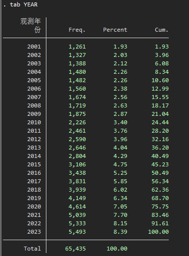

# CSMAR-上市公司实证常用控制变量

## 1. 样本概况

**所有上市公司（共5490个）：**

- 全部A股
  - 上证A股、深证A股、北证A股、上证主板A股、深圳主板A股、科创版、创业版
- 全部B股：
  - 上证B股、深证B股

**时间范围（共14年）：**

2009 - 2022（含2009与2022）

**包含变量：** 

- 11个基本信息变量
- 22个常用控制变量，其中连续变量18个，虚拟变量4个

## 2. 常用控制变量明细（ControlVarsDetail.dta）

| 变量         | 定义                                                         | 备注                                                         |
| ------------ | :----------------------------------------------------------- | :----------------------------------------------------------- |
| **基本信息** |                                                              |                                                              |
| STKCD        | 证券代码                                                     |                                                              |
| STKNM        | 证券简称                                                     |                                                              |
| YEAR         | 观测年份                                                     |                                                              |
| INDCD        | 行业代码                                                     | 证监会2012行业分类标准                                       |
| INDNM        | 行业名称                                                     | 证监会2012行业分类标准                                       |
| PROVCD       | 省份代码                                                     |                                                              |
| PROVNM       | 省份名称                                                     |                                                              |
| CITYCD       | 城市代码                                                     |                                                              |
| CITYNM       | 城市名称                                                     |                                                              |
| MARKET       | 股票市场板块                                                 | 依据股票代码划分，详情见[划分释义](#释义)                  |
| STATE        | 上市状态                                                     |                                                              |
| **连续变量** |                                                              |                                                              |
| AGE          | [企业年龄](#企业年龄)，企业从成立或上市到观测年份的年数    | 公司研究系列👉上市公司基本信息👉上市公司基本信息年度表         |
| BALANCE      | 股权制衡度，第二到第五大股东持股比例之和/第一大股东持股比例  | 公司研究系列👉治理结构👉股东股本👉十大股东文件                  |
| BM           | [账面市值比](#账面市值比)，账面价值/[市场价值](#市场价值) | 公司研究系列👉财务指标分析👉相对价值指标                       |
| BOARD        | 董事规模，董事会人数的自然对数                               | 公司研究系列👉治理结构👉高管动态👉高管人数、持股及薪酬情况表    |
| CFO          | 现金流状况，经营活动产生的现金流量净额/总资产                | 公司研究系列👉财务报表👉现金流量表&资产负债表                  |
| GROWTH       | 营业收入增长率，营业收入的年度增长率                         | 公司研究系列👉财务报表👉利润表                                 |
| INDBOARD     | 独立董事占比，独董人数/董事会人数                            | 公司研究系列👉治理结构👉高管动态👉高管人数、持股及薪酬情况表    |
| INSTITUTION  | 机构持股比例，机构投资者持有股份/总股数                      | 公司研究系列👉机构投资者👉机构持股分类统计表                   |
| LEV          | 资产负债率，总负债/总资产                                    | 公司研究系列👉财务报表👉资产负债表                             |
| MFEE         | 管理层费用率，管理费用/营业收入                              | 公司研究系列👉财务报表👉利润表                                 |
| MHOLD        | 管理层持股比例，董事、监事以及高管持股总数/总股数            | 公司研究系列👉治理结构👉高管动态 (高管人数、持股及薪酬情况表) &股东股本 (股本结构文件) |
| OCCUPY       | 大股东资金占用，其他应收款/总资产                            | 公司研究系列👉财务报表👉资产负债表                             |
| ROA          | 总资产收益率，净利润/总资产                                  | 公司研究系列👉财务报表👉利润表&资产负债表                      |
| ROE          | 净资产收益率，净利润/净资产(所有者权益)                      | 公司研究系列👉财务报表👉利润表&资产负债表                      |
| SIZE         | 公司规模，总资产的自然对数                                   | 公司研究系列👉财务报表👉资产负债表                             |
| TAT          | 总资产周转率，营业收入/总资产                                | 公司研究系列👉财务报表👉利润表&资产负债表                      |
| TobinQ       | 托宾Q值，[企业的托宾Q值](#托宾Q值)                         | 公司研究系列👉财务指标分析👉相对价值指标                       |
| TOP1         | 第一大股东持股比例，第一大股东持股数量/总股数                | 公司研究系列👉治理结构👉股东股本👉十大股东文件                  |
| **虚拟变量** |                                                              |                                                              |
| AUDIT        | 是否由四大会计师事务所审计，是则取1，否则取0                 | 公司研究系列👉分析师预测👉上司公司基本情况👉上市公司基本信息特色指标表 |
| DUAL         | 董事长与总经理是否为同一人，是则取1，否则取0                 | 公司研究系列👉治理结构👉基本数据👉治理综合信息文件              |
| OPINION      | 审计意见是否为标准无保留意见，是则取1，否则取0               | 公司研究系列👉财务报告审计意见👉基本数据👉审计意见表文件        |
| SOE          | 企业股东性质是否为国有企业，是则取1，否则取0                 | 公司研究系列👉股权性质👉中国上市公司股权性质文件               |

### 释义

**A股：** 人民币普通股票，在中国大陆注册、在中国大陆上市的普通股票，以人民币认购和交易。A股与具体的股票代码的对应关系如下：

- 00开头，深证主板A股；30开头，深证创业板
- 60开头，上证主板A股；68开头，上证科创版
- 43、83、87开头，北证A股

**B股：** 

- 20开头，深证B股
- 90开头，上证B股

### 企业年龄

1. AGE1 = 企业从成立年份到观测年份的年龄
2. AGE2 = 企业从上市年份到观测年份的年龄

### 市场价值

1. 市值A = A股\*今收盘价A股当期值 + 境内上市的外资股B股\*今收盘价B股当期值(沪市\*CNY_USD, 深市/HKD_CNY, 转化为人民币) + (总股数-人民币普通股-境内上市的外资股B股) \* (所有者权益合计期末值/实收资本本期期末值) + 负债合计本期期末值
2. 市值B = (总股本-境内上市的外资股B股) \* 今收盘价A股当期值 + 境内上市的外资股B股 \* 今收盘价B股当期值(沪市\*CNY_USD, 深市/HKD_CNY, 转化为人民币) + 负债合计本期期末值

### 账面市值比

1. 账面市值比A = 资产总计 / 市值A
2. 账面市值比A = 资产总计 / 市值B

### 托宾Q值

1. 托宾Q值A = 市值A / 资产总计
2. 托宾Q值B = 市值A / (资产总计-无形资产净额-商誉净额)
3. 托宾Q值C = 市值B / 资产总计
4. 托宾Q值D = 市值B / (资产总计-无形资产净额-商誉净额)

## 3. 在Stata中调用数据

打开Stata，输入如下代码调用数据（**实测GitHub慢但稳定，Gitee快但不稳定**）。

```Stata
*- 从 Gitee 调用数据
copy "https://gitee.com/Shutter_Zor/Commonly-Used-Control-Variables/raw/main/ControlVarsDetail.dta" "ControlVarsDetail.dta"
use "ControlVarsDetail.dta", clear
  *- 或者
  use "https://gitee.com/Shutter_Zor/Commonly-Used-Control-Variables/raw/main/ControlVarsDetail.dta"

*- 从 GitHub 调用数据
copy "https://github.com/ShutterZor/Commonly-Used-Control-Variables/raw/main/ControlVarsDetail.dta" "ControlVarsDetail.dta"
use "ControlVarsDetail.dta", clear
  *- 或者
  use "https://github.com/ShutterZor/Commonly-Used-Control-Variables/raw/main/ControlVarsDetail.dta"
```

如果出现`file not found`之类的错误，意味着网络连接不通畅，可直接将链接复制到浏览器下载。建议开梯子用GitHub的方法下载。

数据调用结果：


查看数据：



接下来只需要保存到本地就行，比如：`save controls.dta, replace`。

